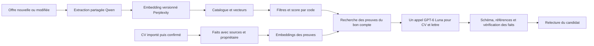

# Embeddings et RAG LeBonTaf — tests du 6 octobre 2026

Choix provisoire : **Perplexity pplx-embed-v1-0.6b pour les embeddings**, **Qwen3.7 Flash pour l'extraction des offres**, **GPT-6 Luna pour l'import textuel du CV et les brouillons CV/lettre**. Le scoring, les filtres, la vérification des références et les clés de cache restent du code. **RAG testé en laboratoire, pas encore intégré en production.**

## Budget réellement observé

Cette suite ajoute 173 requêtes et 170 réponses : 111 requêtes d'embeddings, 32 de reranking, 16 de génération sourcée et 14 d'extraction textuelle de CV. Total avec les comparatifs précédents : **471 requêtes, 464 réponses, 0.063568 USD déclarés**, soit environ 6.36 cents. Réservation conservatrice cumulée : **0.335539 USD**, sous le plafond autorisé de **1 USD**. Les appels échoués restent réservés. Ces coûts retournés ne constituent pas une facture complète.

## Embeddings : les 28 modèles du catalogue ont été testés

Première série : 49 documents (36 offres et 13 éléments de preuve), 12 requêtes d'offres français/anglais et 6 requêtes de preuves. Les offres fermées et les CDI sont retirés par des règles ; des offres du mauvais métier partagent lieu et contrat. Les preuves d'un autre compte ou non vérifiées sont exclues AVANT classement. Les 28 modèles retrouvent tous les éléments pertinents dans les trois premières offres et les deux premières preuves : cette série est trop simple pour départager la qualité.

Deuxième série : 12 offres de métiers proches, toutes à Paris en alternance, 24 requêtes français/anglais et les mêmes 6 requêtes de preuves. Les paires couvrent sécurité/exploitation, modélisation/pilotage, UX/intégration, budget/comptabilité, communication/commercial, paie/recrutement. La bonne offre attendue et la preuve attendue sont étiquetées avant les appels. Le tableau mesure leur présence EN PREMIÈRE POSITION ; il ne s'agit pas de la précision sur toutes les offres du site.

| Modèle | Tarif entrée / million de tokens | Dimensions testées | Bonne offre première | Bonne preuve première | Coût déclaré série 2 |
|---|---:|---:|---:|---:|---:|
| perplexity/pplx-embed-v1-0.6b | 0.004 $ | 1024 | 24/24 | 6/6 | 0.000005 $ |
| alibaba/qwen3-embedding-0.6b | 0.010 $ | 768 | 23/24 | 6/6 | 0.000019 $ |
| alibaba/qwen3-embedding-8b | 0.010 $ | 768 | 23/24 | 6/6 | 0.000019 $ |
| alibaba/qwen3-embedding-4b | 0.020 $ | 768 | 24/24 | 5/6 | 0.000038 $ |
| amazon/titan-embed-text-v2 | 0.020 $ | 1024 | 21/24 | 5/6 | 0.000028 $ |
| openai/text-embedding-3-small | 0.020 $ | 768 | 21/24 | 5/6 | 0.000027 $ |
| voyage/voyage-3.5-lite | 0.020 $ | 1024 | 24/24 | 5/6 | 0.000026 $ |
| voyage/voyage-4-lite | 0.020 $ | 1024 | 24/24 | 6/6 | 0.000026 $ |
| google/text-embedding-005 | 0.025 $ | 768 | 23/24 | 6/6 | 0.000036 $ |
| google/text-multilingual-embedding-002 | 0.025 $ | 768 | Timeout | — | Non mesuré |
| perplexity/pplx-embed-v1-4b | 0.030 $ | 2560 | 21/24 | 6/6 | 0.000040 $ |
| voyage/voyage-3.5 | 0.060 $ | 1024 | 24/24 | 6/6 | 0.000077 $ |
| voyage/voyage-4 | 0.060 $ | 1024 | 24/24 | 6/6 | 0.000077 $ |
| cohere/embed-v5.0-fast | 0.080 $ | 2048 | 24/24 | 6/6 | 0.000098 $ |
| mistral/mistral-embed | 0.100 $ | 1024 | 22/24 | 6/6 | 0.000162 $ |
| openai/text-embedding-ada-002 | 0.100 $ | 1536 | 23/24 | 6/6 | 0.000134 $ |
| cohere/embed-v4.0 | 0.120 $ | 1536 | 23/24 | 6/6 | 0.000161 $ |
| cohere/embed-v5.0-pro | 0.120 $ | 2048 | 24/24 | 6/6 | 0.000137 $ |
| voyage/voyage-4-large | 0.120 $ | 1024 | 24/24 | 6/6 | 0.000154 $ |
| voyage/voyage-code-2 | 0.120 $ | 1536 | 24/24 | 6/6 | 0.000184 $ |
| voyage/voyage-finance-2 | 0.120 $ | 1024 | 23/24 | 6/6 | 0.000187 $ |
| voyage/voyage-law-2 | 0.120 $ | 1024 | 24/24 | 5/6 | 0.000184 $ |
| openai/text-embedding-3-large | 0.130 $ | 768 | 23/24 | 6/6 | 0.000174 $ |
| google/gemini-embedding-001 | 0.150 $ | 768 | 23/24 | 6/6 | 0.000170 $ |
| mistral/codestral-embed | 0.150 $ | 1536 | 22/24 | 6/6 | 0.000201 $ |
| voyage/voyage-3-large | 0.180 $ | 1024 | 23/24 | 6/6 | 0.000231 $ |
| voyage/voyage-code-3 | 0.180 $ | 1024 | 23/24 | 6/6 | 0.000231 $ |
| google/gemini-embedding-2 | 0.200 $ | 768 | 24/24 | 6/6 | 0.000227 $ |

Google text-multilingual-embedding-002 a répondu en série 1 ; son appel documents de série 2 a dépassé 60 secondes, sans relance. Aucune mauvaise note de qualité n'est déduite de cette indisponibilité. Les modèles spécialisés code, finance et droit ont été inclus comme contrôles, pas parce que ces spécialisations sont nécessaires à LeBonTaf.

Les dimensions ne sont pas identiques pour tous : 768 ont été demandées à Google, OpenAI embedding-3 et Qwen ; les autres utilisent leurs dimensions natives. Perplexity est ici testé en **1024**, pas en 768. Les réglages document/query sont transmis aux fournisseurs qui les documentent, avec instruction de recherche pour Qwen. La prise en compte de chaque option par chaque route n'a pas été auditée côté fournisseur. Gateway choisit les routes pour ces embeddings ; les routes et coûts retournés sont conservés dans le journal. Les latences d'un passage de deux lots ne sont pas un test de charge.

**Perplexity 0.6B est le candidat économique retenu**, à 0,004 $/million de tokens d'entrée, 24/24 offres et 6/6 preuves en premier sur la deuxième série. Voyage 4 Lite réussit aussi à 0,020 $/million, en 1024 dimensions. Qwen 0.6B est une autre option à 0,010 $/million, 23/24 offres et 6/6 preuves, testé en 768 dimensions. La supériorité générale d'un modèle n'est pas démontrée par ce petit jeu synthétique ; aucun résultat ne justifie ici de surdimensionner les embeddings.

Exemple budgétaire uniquement : 10 000 offres de 300 tokens chacune = 3 millions de tokens, soit 0,012 $ au tarif Perplexity testé, contre 0,45 $ au tarif Gemini 001. Le nombre réel de tokens dépend du tokenizer. Cette estimation exclut mises à jour, profils, requêtes, génération et hébergement.

## Reranking : utile seulement si son gain est mesuré

Quatre modèles Voyage ont été testés sur huit requêtes et les trois candidats déjà récupérés par Qwen. Cette sélection contient son erreur de première position : 7/8 avant reranking, 8/8 après pour les quatre modèles. Coûts retournés des huit appels : 0,000073 $ pour rerank-2.5 et rerank-3, 0,000029 $ pour leurs versions Lite. La récupération initiale avait déjà la bonne offre dans ses trois candidats ; le reranker ne peut pas récupérer une offre absente de cette liste.

Les trois modèles Cohere disponibles n'ont pas été appelés : leur tarif manque dans le catalogue consulté et le test doit pouvoir borner ses dépenses. Ils restent non comparés. **Ne pas ajouter un appel de reranking par offre ou par visite au lancement** : le candidat Perplexity retrouve déjà 24/24 offres en premier sur ce jeu. Voyage rerank-3-lite est un candidat optionnel pour les cas ambigus, à valider sur un échantillon indépendant.

## Chaîne RAG : retrieval, sources et génération

Le module **lib/rag-evidence.ts** sélectionne des preuves du seul compte authentifié fourni par le serveur, vérifiées et appartenant au même espace de vecteurs. Il refuse modèles, versions et dimensions incompatibles, vecteurs invalides, sources manquantes et identifiants doublons. La clé de cache dépend du compte, de la source, de sa version, du texte, du modèle, des dimensions et de la version du traitement. **22 assertions locales passent** : isolation des comptes, preuves non vérifiées, vecteurs, versions, citations et invalidation de cache. Cette clé n'implémente pas à elle seule le stockage du cache ni un verrou concurrent.

Un test réel utilise les vecteurs Perplexity pour récupérer une preuve, puis envoie cette preuve identifiée au LLM. Six requêtes portent sur des réalisations ; deux demandent une certification absente et l'anglais C2 d'un autre compte. **Qwen et GPT-6 Luna passent chacun 8/8 contrôles techniques** : schéma, références autorisées, citation exacte, refus quand la preuve manque. Coût total des huit appels : 0,000194 $ pour Qwen, 0,000515 $ pour GPT-6 Luna.

La relecture confirme les refus de certification et d'usurpation du niveau C2. Elle relève une réserve : GPT-6 Luna transforme « utilisation de Canva » en « préparer des visuels » dans une réponse. La preuve ne détaille pas explicitement cette action. **Une citation exacte ne prouve pas que toutes les affirmations de la reformulation sont justifiées.** Cette vérification factuelle reste une condition de livraison ; le test ne certifie pas zéro invention.

Le test de certification fournit délibérément une liste de preuves vide après contrôle de l'absence de certification. Un embedding seul renvoie toujours des voisins ; le laboratoire ne démontre pas encore une détection générique de toute question sans réponse ou de tout fait hors sujet. Il faudra l'évaluer avec des cas négatifs et une règle d'abstention adaptée, pas un seuil universel inventé.

## Import du CV : conserver les faits avant toute recherche

Trois modèles ont traité trois CV fictifs sous forme de texte avec le prompt d'import actuel, adapté du PDF au texte. Le premier protocole à schéma strict a rencontré deux HTTP 400 pour les modèles Qwen et GPT-6 Luna ; aucune note de qualité n'est déduite de ces erreurs d'interface. Une seconde passe en mode objet JSON conserve les groupes de compétences libres du prompt.

Les contrôles ont été corrigés à la relecture : un niveau littéral « BTS », présent dans le texte, est autorisé ; le statut **en cours** doit être préservé. Résultats corrigés de seconde passe : GPT-6 Luna 3/3, Gemini 2.5 Flash-Lite 1/3, Qwen 0/3. Gemini et Qwen retirent le statut de formation en cours de leurs deux profils avec formation ; Qwen range aussi le projet minimal dans expérience. La normalisation actuelle éliminerait cette expérience sans intitulé et organisation, perdant le seul projet disponible. Ces résultats concernent les champs vérifiés, pas toute la qualité d'OCR.

GPT-6 Luna est le premier candidat pour **l'extraction du texte**. Les PDF scannés, tableaux, mise en page, pièces jointes et OCR n'ont pas été testés ici. Le contrat de profil devrait conserver explicitement formation en cours et date prévue : les champs actuels sont ambigus et les listes d'éducation normalisées ne conservent pas de champ de statut séparé. La personne doit confirmer les faits importés avant de les considérer comme preuves.

## Ce qui manque dans l'application actuelle

Le code inspecté utilise Gemini 001 en 768 dimensions pour les offres et profils. La génération reçoit encore le profil et le registre entiers ; elle ne récupère pas des preuves vectorisées et identifiées avec ce nouveau module. Le présent test n'a ni écrit en base ni changé les modèles de production.

- **Migration coordonnée des vecteurs** : Perplexity testé en 1024 exige un stockage/index adapté et un rattrapage complet des offres ET profils. Ne jamais comparer de nouveaux profils aux anciennes offres Gemini. Le hash du profil inclut le modèle, mais les RPC actuelles comparent les vecteurs sans vérifier ce modèle côté offres. Même deux modèles en 768 dimensions ne partagent pas automatiquement le même espace.
- **Recalibrage du score** : lib/fit.ts emploie une plage Gemini de 0,50 à 0,80. Les meilleurs résultats Perplexity de cette série vont de 0,206 à 0,478 ; la composante sémantique serait donc ramenée à zéro pour ces bonnes correspondances si ces seuils étaient conservés. Le score SQL doit également évoluer de façon cohérente. Un score de proximité n'est pas un pourcentage de chance d'embauche.
- **RAG des preuves** : stocker les faits confirmés avec propriétaire, source, version et identifiant ; imposer RLS en base ; récupérer les preuves pertinentes en conservant les faits essentiels comme formation et langues ; vérifier les reformulations avant affichage. Les assertions locales ne prouvent pas les politiques SQL de production.
- **Coûts et répétitions** : persister les empreintes, réserver atomiquement les traitements, invalider seulement après changement pertinent, borner reprises et générations. L'enregistrement actuel du profil force encore un embedding. La présence d'une clé de cache testée ne suffit pas à garantir qu'aucun double appel ne se produit en production.
- **Validation réelle** : CV anonymisés représentatifs, annonces longues, questions sans preuve, PDF/OCR, qualité des résumés de production, calibration des scores, rappels et charge des 100 premiers utilisateurs. Des tests synthétiques ne justifient pas de marquer tous ces éléments « Fait ».

## Architecture recommandée

Les éléments de la chaîne sont testés séparément et une sélection de preuves suivie d'une réponse sourcée a été exécutée. Le diagramme représente la cible ; il ne décrit pas une intégration complète déjà déployée.

## Reproduire sans répéter les dépenses

Node 24 : scripts/compare-embeddings.mjs --run, puis --run --hard ; scripts/compare-rerank.mjs --run ; scripts/test-grounded-rag.mjs --run ; scripts/test-cv-extraction.mjs --run --object. Charger la clé locale ignorée avec --env-file=.env.ai-test.local. Chaque protocole saute les requêtes déjà présentes dans le journal, même échouées. Ne pas effacer le journal budgétaire. Exécuter les scripts payants séquentiellement ; ils partagent ce journal.

Audits locaux sans dépense : scripts/audit-rag.mjs puis scripts/audit-embeddings.mjs ; scripts/test-rag-safety.mjs. Les jeux, paramètres, routes retournées, sorties et métriques sont dans test-results/ai-comparison, ignoré par Git. Aucune donnée personnelle réelle n'a été envoyée.

Sources : [API embeddings Gateway](https://vercel.com/docs/ai-gateway/sdks-and-apis/openai-chat-completions/embeddings), [API rerank Gateway](https://vercel.com/docs/ai-gateway/sdks-and-apis/cohere-rerank), [catalogue et tarifs observés](https://ai-gateway.vercel.sh/v1/models), [présentation et modèles Perplexity](https://www.perplexity.ai/en-GB/hub/blog/pplx-embed-state-of-the-art-embedding-models-for-web-scale-retrieval), [instructions Qwen Embedding](https://huggingface.co/Qwen/Qwen3-Embedding-0.6B). Les mesures de ce rapport proviennent de nos appels, pas des classements marketing des fournisseurs.
